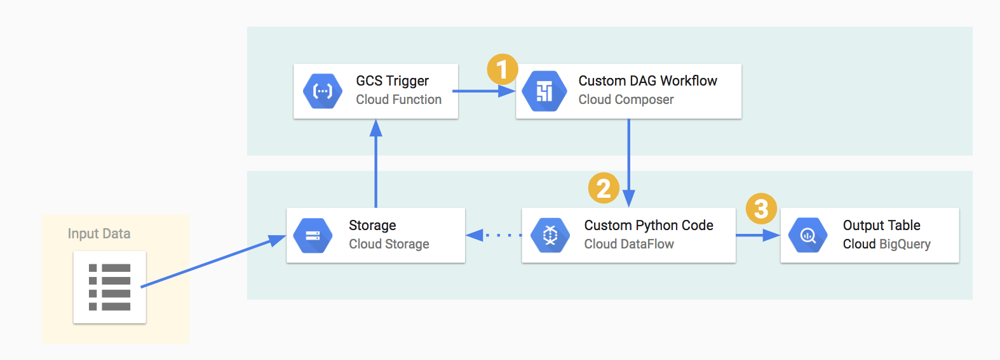

# gcs-dataflow-bigquery

This repository provides a common pattern to automatically trigger, via Google Cloud Function, a Dataflow job when a file arrives in Google Cloud Storage, process the data and load it into BigQuery.

**Benefits**

* **Simple to use:** This repository provides a template for creating a Cloud Function and a Dataflow job that can be easily customized for your specific needs.
* **Scalable:** This solution can scale to handle large volumes of data.
* **Reliable:** This solution is reliable and will automatically process new files as they arrive in Google Cloud Storage.

**Example use cases**

* **Loading data from a CSV file in GCS into a BigQuery table:** You can use this repository to create a data pipeline that automatically loads data from a CSV file in GCS into a BigQuery table. This can be useful for loading data from a variety of sources, such as CRM systems, ERP systems, and website analytics tools.

* **Processing streaming data from a Kafka topic and loading it into BigQuery:** You can use this repository to create a data pipeline that automatically processes streaming data from a Kafka topic and loads it into BigQuery. This can be useful for real-time data processing applications, such as fraud detection and customer behavior analysis.

* **Transforming data in BigQuery using a Dataflow job:** You can use this repository to create a data pipeline that automatically transforms data in BigQuery using a Dataflow job. This can be useful for cleaning data, aggregating data, and joining data from multiple tables.

## Getting started

To use this repository, you will need to:

1. Create a Google Cloud Platform project.
2. Enable the Google Cloud Storage, Google Cloud Functions, and Dataflow APIs.
3. Deploy the Cloud Function.
4. Create a Dataflow job.
5. Configure the Dataflow job to be triggered by the Cloud Function.

Once you have completed these steps, your Dataflow job will be automatically triggered whenever a new file arrives in Google Cloud Storage. The Dataflow job will process the data and load it into BigQuery.
